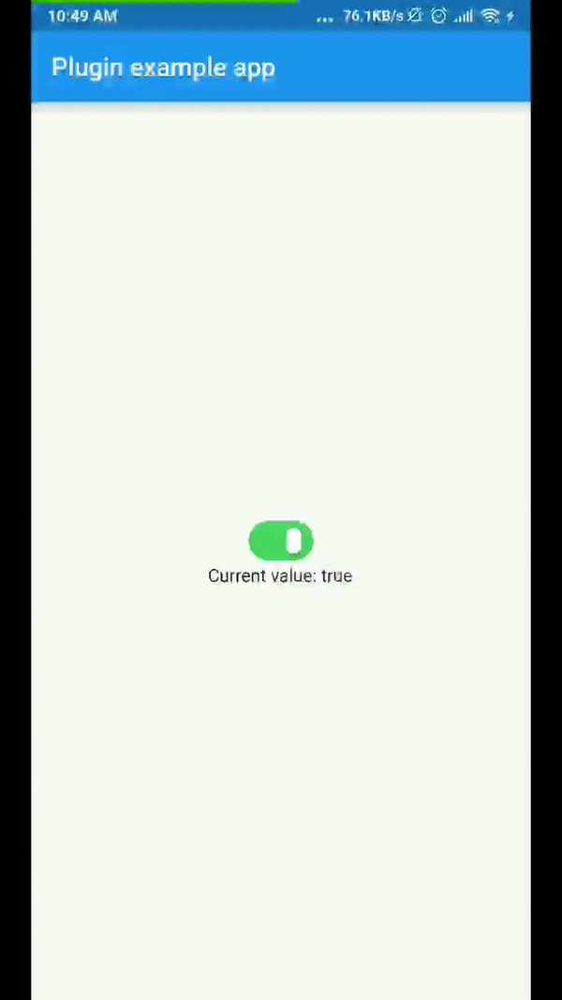

# xlive_switch

A Xlive Switcher plugin for Flutter

## Getting Started

This plugin is based on Oleg Frolov's animation design which I found on Dribbble:
https://dribbble.com/shots/5429846-Switcher-XLIV

Thanks Oleg Forlov for this beautiful design.




## Usage

To use plugin, just import package `import 'package:xlive_switch/xlive_switch.dart';`

You can change the color of the switch follow by these attributes:
 - activeColor: background color when value is true
 - unActiveColor: background color when value is false
 - thumbColor: your thumb color

## Example
```
import 'package:flutter/material.dart';
import 'package:xlive_switch/xlive_switch.dart';

void main() => runApp(MyApp());

class MyApp extends StatefulWidget {
  @override
  _MyAppState createState() => _MyAppState();
}

class _MyAppState extends State<MyApp> {
  bool _value = true;

  @override
  void initState() {
    super.initState();
  }

  @override
  Widget build(BuildContext context) {
    return MaterialApp(
      home: Scaffold(
        appBar: AppBar(
          title: const Text('Plugin example app'),
        ),
        body: Center(
          child: Column(
            mainAxisAlignment: MainAxisAlignment.center,
            children: <Widget>[
              XlivSwitch(
                value: _value,
                onChanged: _changeValue,
              ),
              Text('Current value: $_value'),
            ],
          ),
        ),
      ),
    );
  }

  void _changeValue(bool value) {
    setState(() {
      _value = value;
    });
  }
}

```

